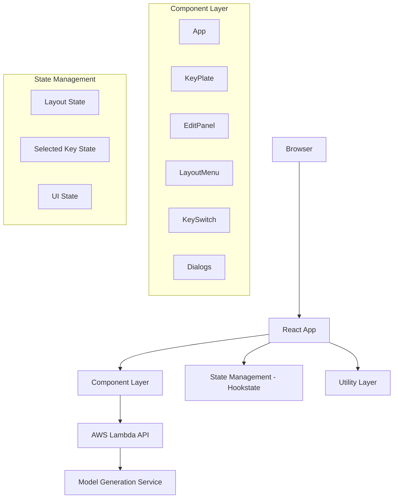
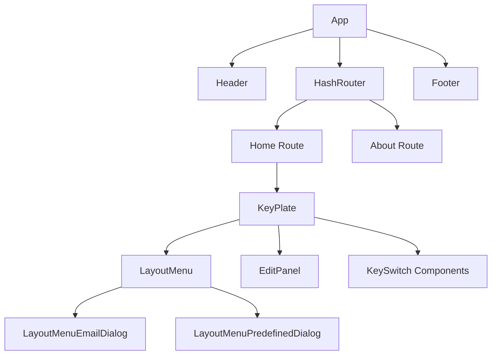
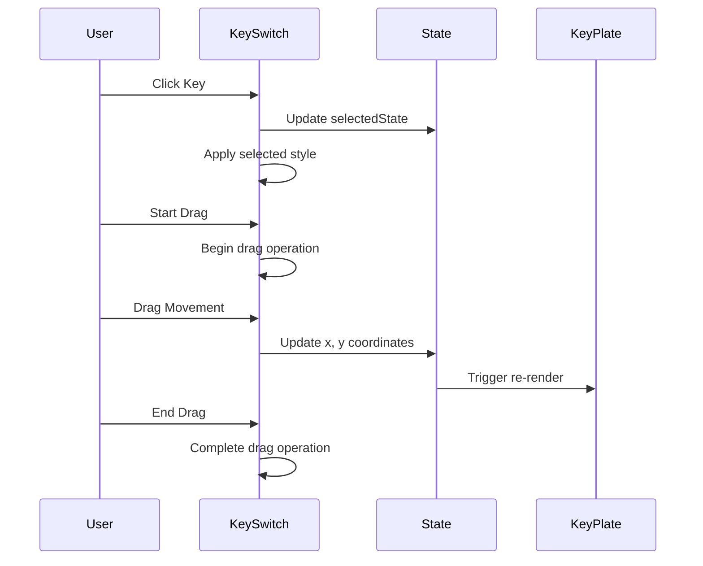

# Design Document

## Overview

기계식 키보드 레이아웃 에디터는 React.js 기반의 단일 페이지 애플리케이션(SPA)으로, 사용자가 키보드 레이아웃을 시각적으로 편집하고 3D/2D 모델을 생성할 수 있는 웹 애플리케이션입니다. 애플리케이션은 컴포넌트 기반 아키텍처를 사용하며, Hookstate를 통한 상태 관리와 Material-UI를 통한 사용자 인터페이스를 제공합니다.

## Architecture

### High-Level Architecture



### Component Hierarchy



## Components and Interfaces

### Core Components

#### 1. App Component
- **역할**: 애플리케이션의 루트 컴포넌트, 라우팅 설정
- **의존성**: React Router, Header, Footer, Navigation
- **상태**: 없음 (상태 없는 컴포넌트)

#### 2. KeyPlate Component
- **역할**: 키보드 레이아웃의 메인 편집 영역
- **상태 관리**: 
  - `layoutState`: 키 배열 상태 관리
  - `selectedState`: 현재 선택된 키 인덱스
- **자식 컴포넌트**: LayoutMenu, EditPanel, KeySwitch[]

#### 3. KeySwitch Component
- **역할**: 개별 키 스위치 렌더링 및 상호작용
- **기능**: 드래그 앤 드롭, 클릭 선택, 시각적 피드백
- **의존성**: react-draggable, LayoutUtil

#### 4. EditPanel Component
- **역할**: 선택된 키의 속성 편집 인터페이스
- **기능**: 라벨 편집, 크기 조정, 키 추가/삭제
- **상태 의존성**: layoutState, selectedState

#### 5. LayoutMenu Component
- **역할**: 레이아웃 파일 관리 및 모델 생성 인터페이스
- **기능**: 파일 업로드/다운로드, 사전 정의된 레이아웃, 모델 생성
- **외부 API**: AWS Lambda 서비스

### State Management Architecture

#### Hookstate 상태 구조

```javascript
// Layout State Structure
layoutState = [
  {
    label: string,    // 키 라벨
    x: number,        // X 좌표 (U 단위)
    y: number,        // Y 좌표 (U 단위)
    w: number,        // 너비 (U 단위)
    h: number         // 높이 (U 단위)
  }
]

// Selected State
selectedState = number  // 선택된 키의 인덱스 (-1: 선택 없음)

// UI States
loadingState = boolean
emailDialogState = {
  open: boolean,
  fmt: string
}
layoutListDialogState = {
  open: boolean,
  predefinedList: string[]
}
```

## Data Models

### Key Data Model

```typescript
interface KeyData {
  label: string;      // 키에 표시될 텍스트
  x: number;          // X 좌표 (U 단위, 0.25 단위로 스냅)
  y: number;          // Y 좌표 (U 단위, 0.25 단위로 스냅)
  w: number;          // 너비 (U 단위, 표준 크기: 1, 1.25, 1.5, 1.75, 2, 2.25, 2.75, 6, 6.25, 6.5, 7)
  h: number;          // 높이 (U 단위, 1 또는 2)
}
```

### Layout Data Model

```typescript
interface LayoutData {
  width: number;      // 플레이트 너비 (U 단위)
  height: number;     // 플레이트 높이 (U 단위)
  layout: KeyData[];  // 키 배열
  fmt?: string;       // 모델 형식 ('stl' | 'dxf')
  email_to?: string;  // 이메일 주소
}
```

### API Response Models

```typescript
interface PredefinedLayoutsResponse {
  result: string[];   // 사용 가능한 레이아웃 파일명 배열
}

interface LayoutFileResponse {
  result: {
    layout: KeyData[];
  };
}

interface ModelGenerationResponse {
  // 서버 응답 구조 (구현에 따라 달라질 수 있음)
}
```

## User Interface Design

### Layout Calculation System

#### 좌표 시스템
- **단위**: U (Unit) - 표준 키 크기 (60px = 1U)
- **그리드**: 0.25U 단위로 스냅
- **원점**: 플레이트 좌상단 (패딩 15px 후)

#### 크기 계산 공식

```javascript
// 픽셀 좌표 계산
keyPosition(x, y) = {
  x: x * 60 + 15,
  y: y * 60 + 15
}

// 키 크기 계산 (테두리 고려)
keySize(w, h) = {
  width: w * 60 - 2,
  height: h * 60 - 2
}

// 플레이트 크기 계산
plateSize(layout) = {
  width: max(key.x + key.w) * 60 + 30,
  height: max(key.y + key.h) * 60 + 30
}
```

### Drag and Drop System

#### 제약 조건
- **그리드 스냅**: 0.25U (15px) 단위
- **경계 제한**: 플레이트 패딩 영역 내부
- **실시간 업데이트**: 드래그 중 좌표 실시간 반영

#### 상호작용 플로우



## External API Integration

### AWS Lambda Service Integration

#### Endpoint Configuration
- **Base URL**: `https://pk92p8sd0k.execute-api.ap-northeast-2.amazonaws.com/main`
- **Authentication**: 없음 (공개 API)
- **Content-Type**: `application/json`

#### API Endpoints

##### 1. Get Predefined Layouts
```
GET /layouts
Response: {
  result: string[]  // 레이아웃 파일명 배열
}
```

##### 2. Get Specific Layout
```
GET /layouts/{filename}
Response: {
  result: {
    layout: KeyData[]
  }
}
```

##### 3. Generate Model
```
POST /modeling
Body: {
  width: number,
  height: number,
  layout: KeyData[],
  fmt: 'stl' | 'dxf',
  email_to: string
}
```

### File System Integration

#### JSON Layout File Format
```json
{
  "width": 15,
  "height": 5,
  "layout": [
    {
      "label": "Esc",
      "x": 0,
      "y": 0,
      "w": 1,
      "h": 1
    }
  ]
}
```

## Error Handling

### Client-Side Error Handling

#### 1. Input Validation
- **키 속성 입력**: 유효하지 않은 값 무시
- **파일 업로드**: JSON 형식 검증
- **이메일 입력**: 정규식 기반 유효성 검사

#### 2. State Management Errors
- **선택 상태 검증**: 유효한 인덱스 범위 확인
- **레이아웃 상태 일관성**: 키 추가/삭제 시 상태 동기화

#### 3. Network Error Handling
```javascript
// API 호출 에러 처리 패턴
try {
  const response = await axios.get(url);
  // 성공 처리
} catch (error) {
  console.error('API Error:', error);
  // 사용자에게 에러 메시지 표시
  // 로딩 상태 해제
}
```

### User Experience Error Handling

#### Loading States
- **API 호출 중**: CircularProgress 표시
- **중복 클릭 방지**: 로딩 중 버튼 비활성화
- **상태 복원**: 에러 발생 시 이전 상태로 복원

#### Error Messages
- **네트워크 오류**: "서버 연결에 실패했습니다"
- **파일 형식 오류**: "올바른 JSON 파일을 선택해주세요"
- **이메일 형식 오류**: "유효하지 않은 이메일입니다"

## Testing Strategy

### Unit Testing

#### Component Testing
- **KeySwitch**: 드래그, 클릭, 렌더링 테스트
- **EditPanel**: 속성 변경, 키 추가/삭제 테스트
- **LayoutMenu**: 파일 업로드/다운로드, API 호출 테스트

#### Utility Testing
- **LayoutUtil**: 좌표 계산, 크기 계산 함수 테스트
- **상태 관리**: Hookstate 상태 변경 로직 테스트

### Integration Testing

#### Component Integration
- **KeyPlate + KeySwitch**: 다중 키 상호작용 테스트
- **EditPanel + State**: 속성 변경이 키에 반영되는지 테스트
- **LayoutMenu + API**: 외부 서비스 통합 테스트

#### User Flow Testing
- **레이아웃 편집 플로우**: 키 추가 → 편집 → 저장
- **파일 관리 플로우**: 업로드 → 편집 → 다운로드
- **모델 생성 플로우**: 편집 → 이메일 입력 → 생성 요청

### End-to-End Testing

#### Critical User Journeys
1. **새 레이아웃 생성**: 키 추가 → 배치 → 속성 편집 → 저장
2. **기존 레이아웃 편집**: 파일 로드 → 수정 → 저장
3. **모델 생성**: 레이아웃 완성 → STL/DXF 생성 요청

#### Browser Compatibility Testing
- **Chrome, Firefox, Safari**: 주요 브라우저 호환성
- **모바일 브라우저**: 터치 인터페이스 지원 확인
- **드래그 앤 드롭**: 다양한 환경에서 동작 확인

## Performance Considerations

### Rendering Optimization
- **React.memo**: 불필요한 리렌더링 방지
- **상태 최적화**: 필요한 컴포넌트만 업데이트
- **이벤트 핸들러**: 디바운싱으로 과도한 업데이트 방지

### Memory Management
- **이벤트 리스너**: 컴포넌트 언마운트 시 정리
- **API 요청**: 취소 가능한 요청 구현
- **파일 처리**: 대용량 파일 처리 시 메모리 관리

### Network Optimization
- **API 호출 최적화**: 불필요한 중복 요청 방지
- **파일 크기**: JSON 파일 압축 고려
- **캐싱**: 사전 정의된 레이아웃 캐싱