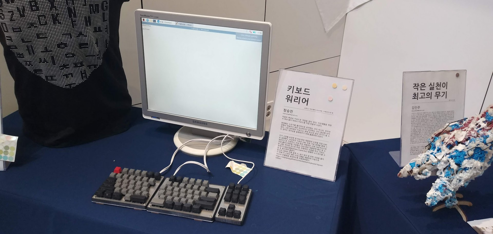

# Mechanical Keyboard Layout Editor

## Demo
https://sinjinjang.github.io/mechanical-keyboard-layout-editor/

## Overview
Mechanical Keyboard Layout Editor는 기계식 키보드를 DIY로 제작하기 위해 키 스위치를 원하는 대로 배치하고 이를 json 형식으로 저장할 수 있는 웹 애플리케이션입니다.

이는 제가 개인적으로 진행 중인 인체 공학 기계식 키보드(*1)를 직접 만들기 위한 프로젝트 중의 한 과정입니다. 먼저 이 앱을 통하여 키보드 스위치의 배치를 완료하면 json 형식의 layout 파일이 만들어지고, layout 파일을 읽어들여 3D 프린팅 혹은 CNC 밀링을 할 수 있는 3D stl 혹은 2D dxf 모델을 생성하게 됩니다. CAD 모델을 출력한 후 기성품 스위치(Cherry MX 스위치 혹은 호환 제품)와 키캡을 구매하여 조립을 하면 됩니다. 후속 작업으로 키보드 제어 MICOM H/W와의 배선 및 납땜과 MICOM 펌웨어 빌드를 하면 직접 만든 키보드를 쓸 수 있게 됩니다.

이 앱의 개발은 [Keyboard Layout Editor](http://www.keyboard-layout-editor.com/) 사이트에서 많은 영감을 받았습니다. 다만 이 사이트의 경우 키 배치와 키캡 제작까지 커버를 하는 반면, 저는 순수하게 키 배치 편집 만을 담당하고 있습니다. 이 프로젝트의 주요 목표는 인체 공학 기계식 키보드의 제작이지만, 부가적으로 react.js의 스터디도 겸하고 있고 KLE에서의 기능을 좀 더 확장하고자 하여 직접 개발을 진행하게 되었습니다.

## How to run this App

1. 저장소 clone 또는 소스 코드 다운로드
2. 의존성 모듈 설치: ```npm install```
3. 앱 실행
    * development 모드: ```npm start```
    * production 모드: ```npm run build``` then deploy on web server

## Photos of first product

|  |
| :-------------------------------: |
|       <i>최종 완성 작품</i>       |

|  |
| :-----------------------------------------------------------------------------------------------: |
|          <i>대전 국립중앙과학관 제2회 과학관과 메이커의 기발한 전시 (과메기전) 출품</i>           |

---

*1: 인체공학이라고 해서 특별한 구조가 있다기 보다는, 좌우가 분리되어 있고 몇몇 키를 좀 더 추가(좌, 우 양쪽에 B키 추가)하고, 방향키와 INS/DEL/HOME/END/PGUP/PGDN 키가 있는 키보드를 만들 예정입니다.
